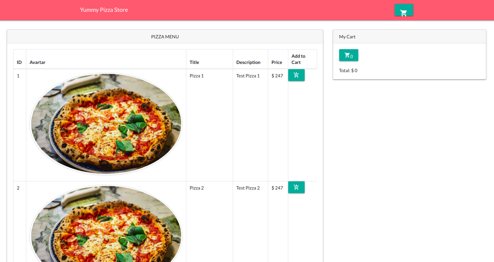

# Yummy Pizza Test
---


## Overview
This is a simple web application that enables clients to order pizza from the available menu

### Url
The application can be found at the url below:<br>
 [here](https://yummy-pizza-store.herokuapp.com)
 
#### Installation (Backend)
first clone the repository
```php
git clone https://github.com/Dickens-odera/Yummy-Pizza-Test.git
```
then install the packages with composer
```php
composer install
```
Generate app key
```php
php artisan key:generate
```
Make a copy of the .env.exaple and create a database in your db server
```php
copy .env.example .env
```
<p>At the Created .env file add the follwing:</p>
DB_PORT=3306<br>
DB_DATABASE=<your_database_name><br>
DB_USERNAME=root<br>

Run the database migrations to create the tables
```php
php artisan migrate
```

### Installation (Frontend)
<p>npm install</p>
<p>npm run watch</p>

